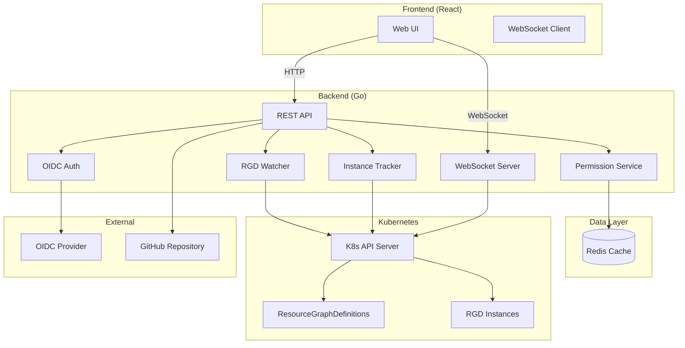



# Welcome to knodex

**knodex** is a comprehensive web-based visualization and management platform for Kubernetes Resource Orchestrator (KRO) ResourceGraphDefinitions (RGDs). It provides an intuitive interface for browsing, deploying, and managing complex Kubernetes resources through KRO's powerful orchestration capabilities.

## What is knodex?

knodex simplifies the deployment and management of Kubernetes resources by:


**knodex is a consolidated interface** for browsing and deploying RGD instances. It does **not** manage the lifecycle of instances or their underlying resources.

- **Instance state and reconciliation** is handled by [kro](https://kro.run) (Kubernetes Resource Orchestrator)
- **Underlying resource management** is performed by kro or other controllers referenced in the RGD (e.g., Crossplane, ACK, external operators)
- **knodex responsibility** is limited to creating, viewing, and deleting instance custom resources

If an instance shows unexpected status, check the kro controller logs and the controllers managing the underlying resources.


knodex simplifies the deployment and management of Kubernetes resources by:

- **Browsing RGD Catalogs** - Discover and explore ResourceGraphDefinitions with rich metadata and dependency visualizations
- **Dynamic Form Generation** - Deploy instances through automatically generated forms based on CRD schemas
- **GitOps Integration** - Support for Direct, GitOps, and Hybrid deployment modes with GitHub integration
- **Project Management** - Multi-tenant architecture with RBAC and project-scoped resource isolation
- **Real-time Updates** - WebSocket-based live status updates for deployed instances
- **OIDC Authentication** - Enterprise SSO integration with group-based access control

## Key Features

### Resource Discovery & Visualization

- Browse all ResourceGraphDefinitions in your cluster
- View dependency graphs showing relationships between RGDs
- Search and filter by namespace, tags, and metadata
- See resource utilization and instance counts

### Simplified Deployment

- Auto-generated deployment forms from CRD schemas
- Built-in validation and error handling
- Dependency resolution and deployment ordering
- YAML preview before deployment

### Enterprise Security & RBAC

- OIDC/OAuth2 authentication with SSO providers (Okta, Auth0, Azure AD, etc.)
- Role-based access control with 4 built-in roles (Global Admin, Platform Admin, Developer, Viewer)
- Project-scoped resource isolation
- Audit logging for compliance

### GitOps Workflow Support

- **Direct Mode:** Deploy directly to Kubernetes cluster
- **GitOps Mode:** Commit manifests to GitHub repository for ArgoCD/Flux
- **Hybrid Mode:** Deploy to cluster AND commit to repository
- Repository configuration per project

### Instance Lifecycle Management

- Real-time status tracking (Pending, Ready, Degraded, Failed)
- Health checks and readiness indicators
- Instance deletion with proper cleanup

## Quick Links

- **[Getting Started](getting-started/)** - New to knodex? Start here for installation and first deployment
- **[Operator Manual](operator-manual/)** - Comprehensive guide for operators deploying and maintaining the platform
- **[Platform Guide](platform-guide/)** - Admin-focused guide for managing projects, users, and repositories
- **[User Guide](user-guide/)** - End-user guide for browsing catalogs and deploying instances

## Architecture Overview

## Technology Stack

- **Frontend:** React 19, TypeScript, Vite, TailwindCSS v4, shadcn/ui
- **Backend:** Go 1.24, Gin framework
- **Real-time:** WebSockets (gorilla/websocket)
- **Cache:** Redis for permission caching and session storage
- **Authentication:** OIDC/OAuth2 integration
- **Deployment:** Kubernetes (Helm charts + Kustomize)
- **CI/CD:** GitHub Actions with AI-powered code review

## Use Cases

### For Platform Teams

- Centralized catalog of all deployable resources
- Self-service deployment portal for development teams
- GitOps workflows with audit trails
- RBAC enforcement at the platform level

### For Developers

- Discover available resources without reading YAML
- Deploy complex multi-resource applications with simple forms
- Track deployment status in real-time
- Manage instances within their project scope

### For Operators

- Unified interface for all RGD deployments
- Monitor instance health across namespaces
- Troubleshoot failed deployments with detailed status
- Audit deployment history and changes

## System Requirements

- Kubernetes 1.27+ cluster with KRO installed
- Redis 7.0+ for caching and sessions
- OIDC provider for authentication (optional for local admin)
- GitHub repository for GitOps deployments (optional)

## Getting Help

- **Documentation:** You're reading it! Use the search bar above to find specific topics
- **GitHub Issues:** [Report bugs or request features](https://github.com/knodex/knodex/issues)
- **Architecture:** See [Architecture Documentation](operator-manual/installation/#architecture) for system design details

## License

knodex is open source. See the [LICENSE](https://github.com/knodex/knodex/blob/main/LICENSE) file for details.

---

**Ready to get started?** Head to the [Getting Started Guide](getting-started/) for installation instructions.
