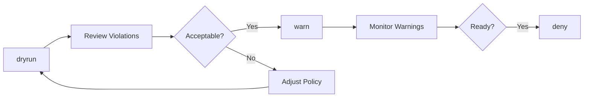



# Compliance Management

Monitor OPA Gatekeeper policy violations and manage constraint enforcement actions in knodex.

## Overview

The Compliance dashboard provides visibility into your Kubernetes cluster's policy compliance status. As a **Platform Admin** or **Project Admin**, you can:

- View constraint templates and their configurations
- Monitor active constraints and violation counts
- Change constraint enforcement actions (deny, warn, dryrun)
- Track violations across namespaces


Compliance management requires an Enterprise license. Contact your administrator to enable this feature.


## Prerequisites

Before using compliance features, ensure:

- OPA Gatekeeper is installed in your Kubernetes cluster
- You have a Platform Admin or Project Admin role with `compliance` permissions
- The knodex service account has the required Kubernetes RBAC permissions

**Background knowledge** (optional but helpful):
- [OPA Gatekeeper](https://open-policy-agent.github.io/gatekeeper/) - Kubernetes policy controller
- Rego - The policy language used by Gatekeeper

## Viewing Compliance Status

### Accessing the Compliance Dashboard

1. Navigate to **Compliance** in the left sidebar
2. The dashboard shows a summary of:
   - Total constraints
   - Total violations
   - Constraints by enforcement action

### Summary Statistics

| Metric | Description |
|--------|-------------|
| **Total Constraints** | Number of active OPA Gatekeeper constraints |
| **Total Violations** | Count of resources violating policies |
| **By Enforcement** | Breakdown by deny, warn, and dryrun modes |

## Constraint Templates

Constraint templates define the policy logic using Rego (Gatekeeper's policy language). Templates are read-only in knodex.

### Viewing Templates

1. Navigate to **Compliance** → **Templates**
2. View all available constraint templates
3. Click a template to see:
   - Template name and description
   - Rego policy code
   - Parameter schema
   - Constraints using this template

### Template Details

| Field | Description |
|-------|-------------|
| **Name** | Template identifier (e.g., `K8sRequiredLabels`) |
| **Description** | What the policy enforces |
| **Parameters** | Configurable values for constraints |
| **Constraints** | Number of constraints using this template |

## Managing Constraints

Constraints are instances of templates with specific parameters and targets.

### Viewing Constraints

1. Navigate to **Compliance** → **Constraints**
2. Filter by:
   - Template type
   - Enforcement action
   - Violation count
3. Click a constraint to view details

### Constraint Details

| Field | Description |
|-------|-------------|
| **Name** | Constraint identifier |
| **Template** | Parent constraint template |
| **Enforcement** | Current enforcement action |
| **Violations** | Resources violating this constraint |
| **Match** | Kubernetes resources this constraint applies to |

## Changing Enforcement Actions

Adjust how a constraint responds to violations without modifying the policy itself.

### Enforcement Action Types

| Action | Behavior | Use Case |
|--------|----------|----------|
| **deny** | Blocks resource creation/update | Production enforcement |
| **warn** | Allows resource but logs warning | Gradual rollout |
| **dryrun** | Records violations without blocking | Policy testing |

### Updating Enforcement Action

1. Navigate to **Compliance** → **Constraints**
2. Find the constraint to update
3. Click the **Enforcement** dropdown
4. Select the new action:
   - `deny` - Block violating resources
   - `warn` - Allow with warning
   - `dryrun` - Audit only
5. Confirm the change


Changing from `dryrun` to `deny` may immediately block deployments that violate the policy. Review violations before changing enforcement.


### Rollout Strategy

When introducing a new policy:



**Recommended steps:**

1. **Start with dryrun**: Deploy constraint in dryrun mode
2. **Review violations**: Check what resources would be blocked
3. **Notify teams**: Communicate upcoming policy enforcement
4. **Switch to warn**: Allow deployments but generate warnings
5. **Monitor warnings**: Track compliance improvements over time
6. **Enable deny**: Enforce the policy after teams have remediated

## Viewing Violations

### Violations List

1. Navigate to **Compliance** → **Violations**
2. View all current policy violations
3. Filter by:
   - Constraint name
   - Namespace
   - Resource type

### Violation Details

| Field | Description |
|-------|-------------|
| **Resource** | Violating Kubernetes resource |
| **Namespace** | Where the resource is deployed |
| **Constraint** | Policy being violated |
| **Message** | Violation description |
| **Enforcement** | Current enforcement action |

### Resolving Violations

To fix a violation:

1. Review the violation message
2. Update the violating resource to comply with the policy
3. The violation clears automatically when the resource is compliant

## Required Permissions

### Application Permissions (Casbin RBAC)

To manage compliance features, your role must include:

| Action | Resource | Description |
|--------|----------|-------------|
| `get` | `compliance/*` | View constraints and violations |
| `update` | `compliance/*` | Change enforcement actions |

**Example policy for project admin:**

```csv
p, proj:my-project:admin, compliance, *, *, allow
```

### Kubernetes Permissions

The knodex service account requires ClusterRole permissions:

| API Group | Resources | Verbs |
|-----------|-----------|-------|
| `templates.gatekeeper.sh` | `constrainttemplates` | get, list, watch |
| `constraints.gatekeeper.sh` | `*` | get, list, watch, update, patch |
| `status.gatekeeper.sh` | `constraintpodstatuses`, `constrainttemplatepodstatuses` | get, list, watch |


If enforcement action updates fail with permission errors, contact your cluster administrator to verify RBAC permissions.


---

**Next:** [Deployment Modes](../user-guide/deployment-modes/) | **Previous:** [Project Management](../user-guide/project-management/)
