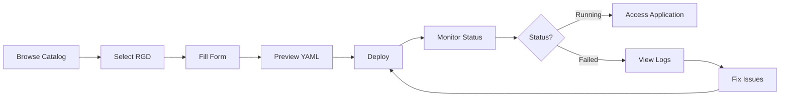



# User Guide

Comprehensive guide for developers and viewers using knodex to browse, deploy, and manage applications.

## Overview

The User Guide provides step-by-step instructions for:

- **Browsing the Catalog**: Discover available RGDs and templates
- **Deploying Instances**: Launch applications with custom configurations
- **Managing Instances**: Monitor, update, and delete deployed resources
- **Viewing Logs**: Debug applications and monitor health
- **Compliance Management**: Monitor policy violations and manage enforcement (Enterprise)

## Who This Guide Is For

**Developers** and **Viewers** who need to:

- Browse available ResourceGraphDefinitions (RGDs)
- Deploy applications to Kubernetes
- Monitor instance status and logs
- Manage deployed resources
- Troubleshoot application issues

## Quick Links

- [Browsing Catalog](browsing-catalog/) - Discover available RGDs, search, filter, and view details
- [Deploying Instances](deploying-instances/) - Deploy applications with guided forms and YAML preview
- [Managing Instances](managing-instances/) - Monitor status, update configurations, and delete instances
- [Viewing Logs](viewing-logs/) - Access logs, monitor metrics, and troubleshoot issues

## Getting Started

### Prerequisites

Before using knodex:

- ✅ You have an account and can log in
- ✅ You are a member of at least one organization
- ✅ You have a role assigned (Developer or Viewer)
- ✅ Your organization has RGDs available (from catalog or repositories)

### First-Time Users

**5-Minute Quickstart:**

1. **Login**: Navigate to knodex and authenticate via SSO
2. **Browse**: Explore the RGD catalog in the sidebar
3. **Select RGD**: Choose an application template (e.g., "Nginx Web App")
4. **Deploy**: Fill in the deployment form and click "Deploy"
5. **Monitor**: Watch your instance status change from "Pending" → "Running"

See [Quickstart Guide](../getting-started/quickstart/) for detailed walkthrough.

## User Roles and Permissions

### Developer

Can deploy and manage instances within organization.

**Permissions:**

| Action                        | Allowed              |
| ----------------------------- | -------------------- |
| Browse RGD catalog            | ✅ Yes               |
| View RGD details              | ✅ Yes               |
| Deploy instances              | ✅ Yes               |
| View own instances            | ✅ Yes               |
| Update own instances          | ✅ Yes               |
| Delete own instances          | ✅ Yes               |
| View other users' instances   | ✅ Yes (in same org) |
| Delete other users' instances | ❌ No                |

### Viewer

Read-only access to organization resources.

**Permissions:**

| Action             | Allowed              |
| ------------------ | -------------------- |
| Browse RGD catalog | ✅ Yes               |
| View RGD details   | ✅ Yes               |
| Deploy instances   | ❌ No                |
| View instances     | ✅ Yes (in same org) |
| Update instances   | ❌ No                |
| Delete instances   | ❌ No                |


If you need different permissions, contact your Platform Admin to update your role.


## Common Workflows

### Deploy a New Application



**Steps:**

1. Navigate to RGD Catalog
2. Search/filter for desired RGD
3. Click "Deploy" button
4. Fill deployment form (name, replicas, etc.)
5. Review generated YAML
6. Click "Deploy Now"
7. Monitor instance in "Instances" view

### Update a Running Instance

**Steps:**

1. Navigate to "Instances"
2. Find your instance
3. Click "Edit" button
4. Update configuration (e.g., replicas: 2 → 5)
5. Review diff
6. Click "Apply Changes"
7. Watch rolling update

### Delete an Instance

**Steps:**

1. Navigate to "Instances"
2. Find your instance
3. Click "Delete" button (trash icon)
4. Confirm deletion (type instance name)
5. Instance and all resources removed

## Navigation

### Sidebar Menu

| Section           | Description                                           |
| ----------------- | ----------------------------------------------------- |
| **Views**         | Custom filtered views of the RGD catalog (Enterprise) |
| **Catalog**       | Browse available RGDs                                 |
| **Instances**     | View and manage deployed instances                    |
| **Organizations** | View organization details (Platform Admin only)       |
| **Profile**       | Manage account settings                               |

### Search

Use the global search bar (top right) to quickly find:

- RGDs by name or description
- Instances by name or status
- Organizations (if Global Admin)

**Keyboard Shortcut:** Press `/` to focus search bar

## Best Practices

### Naming Instances

Use descriptive, unique names:

| ❌ Bad        | ✅ Good                        |
| ------------- | ------------------------------ |
| `app`         | `frontend-webapp-prod`         |
| `test`        | `api-service-dev`              |
| `my-instance` | `user-profile-service-staging` |

**Pattern:** `{service}-{environment}` or `{feature}-{service}-{environment}`

### Resource Requests

Set appropriate resource limits:

**Development:**

```yaml
resources:
  requests:
    cpu: 100m
    memory: 128Mi
  limits:
    cpu: 500m
    memory: 512Mi
```

**Production:**

```yaml
resources:
  requests:
    cpu: 500m
    memory: 1Gi
  limits:
    cpu: 2000m
    memory: 4Gi
```

### Labels and Annotations

Add metadata for organization:

```yaml
metadata:
  labels:
    app: my-webapp
    environment: production
    team: engineering
  annotations:
    description: "User-facing web application"
    owner: "alice@example.com"
    cost-center: "cc-1234"
```

## Troubleshooting

### Instance Stuck in "Pending"

**Possible Causes:**

- Insufficient resources in cluster
- Image pull errors
- Invalid configuration

**Solution:** Click instance → **Logs** tab → check pod events

---

### Cannot Deploy Instances

**Cause:** Viewer role (read-only access)

**Solution:** Contact Platform Admin to upgrade to Developer role

---

### Instance Shows "Failed" Status

**Cause:** Application crashed or failed health checks

**Solution:**

1. Click instance → **Logs** tab
2. Review error messages
3. Fix configuration issues
4. Update instance or redeploy

---

## Getting Help

### In-App Documentation

Access contextual help by clicking the **?** icon next to any field or section.

### Support Channels

1. **Search Documentation**: Full-text search available in sidebar
2. **Contact Platform Admin**: For organization-specific issues
3. **GitHub Issues**: Report bugs or request features

## Section Overview

| Section                                         | Description                                    |
| ----------------------------------------------- | ---------------------------------------------- |
| [Browsing Catalog](browsing-catalog/)           | Discover available RGDs                        |
| [Deploying Instances](deploying-instances/)     | Launch applications                            |
| [Managing Instances](managing-instances/)       | Monitor and update instances                   |
| [Viewing Logs](viewing-logs/)                   | Debug and troubleshoot                         |
| [Compliance Management](compliance-management/) | Policy violations and enforcement (Enterprise) |

---

**Next:** [Browsing the Catalog](browsing-catalog/) →
