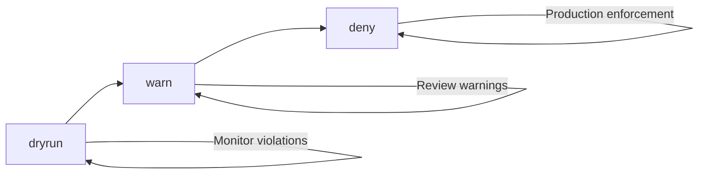

import ProductTag from "@site/src/components/ProductTag";

<ProductTag tags={["enterprise"]} />

# Compliance Management

Knodex Enterprise integrates with OPA Gatekeeper to provide a compliance dashboard for viewing and managing policy enforcement across your cluster.

## Overview

The compliance dashboard surfaces Gatekeeper resources directly in the Knodex UI:

- **ConstraintTemplates** -- Define policy logic using Rego
- **Constraints** -- Instantiate templates with parameters and match rules
- **Violations** -- Track resources that violate active constraints

## Prerequisites

- Knodex Enterprise license with the `compliance` feature
- OPA Gatekeeper installed in the cluster
- Knodex server ServiceAccount with read access to Gatekeeper CRDs

## Viewing Compliance Status

### Dashboard

Navigate to **Compliance** in the Knodex sidebar. The dashboard shows a summary of your compliance posture.

### Summary Statistics

| Metric | Description |
|--------|-------------|
| Total Templates | Number of ConstraintTemplates in the cluster |
| Total Constraints | Number of active Constraints across all templates |
| Total Violations | Number of resources currently in violation |
| Enforcement Rate | Percentage of constraints in `deny` mode vs `dryrun` or `warn` |

## Constraint Templates

### Viewing Templates

The **Templates** tab lists all ConstraintTemplates with their metadata, constraint count, and violation summary.

### Template Details

| Field | Description |
|-------|-------------|
| Name | ConstraintTemplate resource name |
| Kind | The constraint kind this template creates (e.g., `K8sRequiredLabels`) |
| Description | From the `knodex.io/compliance` annotation or template metadata |
| Parameters | Schema of parameters accepted by constraints |
| Constraint Count | Number of constraints created from this template |
| Total Violations | Aggregate violations across all constraints of this kind |

## Managing Constraints

### Viewing Constraints

The **Constraints** tab lists all constraints with their template kind, enforcement action, match rules, and violation count.

### Constraint Details

| Field | Description |
|-------|-------------|
| Name | Constraint resource name |
| Kind | The ConstraintTemplate kind (e.g., `K8sRequiredLabels`) |
| Enforcement Action | `deny`, `dryrun`, or `warn` |
| Match Rules | Kinds, namespaces, and label selectors the constraint applies to |
| Parameters | Template-specific parameters |
| Violations | Resources currently violating this constraint |

## Changing Enforcement Actions

Knodex allows changing the enforcement action on existing constraints without editing YAML.

### Enforcement Action Types

| Action | Behavior |
|--------|----------|
| `deny` | Block non-compliant resources from being created or updated |
| `dryrun` | Record violations without blocking. Resources are created normally. |
| `warn` | Allow creation but return a warning to the user |

### Updating Enforcement

1. Navigate to the constraint detail page
2. Click the enforcement action badge
3. Select the new enforcement action from the dropdown
4. Confirm the change

:::note[Cluster Impact]
Changing enforcement from `dryrun` to `deny` immediately blocks non-compliant resources. Test with `warn` first to understand the impact.
:::

### Rollout Strategy

A safe rollout for new constraints follows this progression:

1. Deploy the constraint with `dryrun` to discover existing violations
2. Move to `warn` to alert users without blocking
3. After violations are resolved, switch to `deny` for full enforcement

## Viewing Violations

### Violation List

The **Violations** tab shows all current violations across the cluster, filterable by constraint kind, namespace, and resource type.

### Violation Details

| Field | Description |
|-------|-------------|
| Resource | The violating resource (Kind, name, namespace) |
| Constraint | The constraint that was violated |
| Template Kind | The ConstraintTemplate kind |
| Message | Human-readable violation message from the Rego policy |
| Enforcement Action | Whether this violation is blocking (`deny`) or informational (`dryrun`/`warn`) |

### Resolving Violations

Violations are resolved by either:

1. **Fixing the resource** -- Update the resource to comply with the constraint
2. **Updating the constraint** -- Modify match rules or parameters to exclude the resource
3. **Changing enforcement** -- Switch to `dryrun` if the constraint is too restrictive

Violations are cleared automatically when the resource is updated or deleted. Gatekeeper re-evaluates on resource changes.

## Required Permissions

### Casbin Permissions

Users need the following Casbin policies to access compliance features:

| Action | Policy |
|--------|--------|
| View compliance dashboard | `compliance/*, get, allow` |
| Change enforcement action | `compliance/*, update, allow` |

### Kubernetes Permissions

The Knodex server ServiceAccount needs these cluster-level permissions:

| Resource | API Group | Verbs |
|----------|-----------|-------|
| `constrainttemplates` | `templates.gatekeeper.sh` | `get`, `list`, `watch` |
| `*` (all constraint kinds) | `constraints.gatekeeper.sh` | `get`, `list`, `watch`, `patch` |

The Helm chart's default ClusterRole includes these permissions when `enterprise.gatekeeper.enabled=true` in values.
