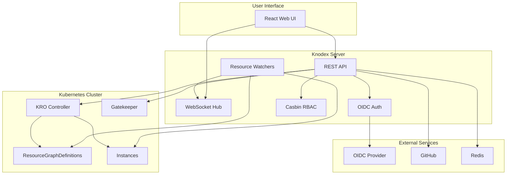

import ProductTag from "@site/src/components/ProductTag";

<ProductTag tags={["oss", "enterprise"]} />

# Knodex Documentation

Welcome to the Knodex documentation. Knodex is a comprehensive web platform for visualizing and managing Kubernetes Resource Orchestrator (KRO) ResourceGraphDefinitions (RGDs). It provides a unified interface for platform teams, developers, and operators to discover, deploy, and manage Kubernetes resource compositions.

## Key Features

- **Resource Discovery** - Browse and search a catalog of ResourceGraphDefinitions with full schema visualization
- **Simplified Deployment** - Deploy instances through auto-generated forms with validation, no YAML required
- **Enterprise Security** - OIDC authentication, Casbin-based RBAC, project isolation, and audit trails
- **GitOps Support** - GitHub integration for version-controlled deployments with drift detection
- **Instance Management** - Monitor, update, and manage deployed instances with real-time status updates

## Architecture Overview

## Technology Stack

| Component | Technology |
|-----------|-----------|
| Server | Go 1.25 |
| Web UI | React 19, TypeScript, Vite |
| Styling | TailwindCSS v4, Radix UI |
| State | React Query, Zustand |
| Auth | OIDC, Casbin RBAC |
| Graph Visualization | XY Flow |
| Cache/Sessions | Redis 7.0+ |
| Deployment | Helm 3, Kubernetes 1.32+ |
| Orchestration | KRO (Kubernetes Resource Orchestrator) |

## Use Cases

### Platform Teams

Define ResourceGraphDefinitions that encode infrastructure best practices, then expose them through the Knodex catalog for self-service consumption by development teams.

### Developers

Discover available resource compositions in the catalog, deploy instances through intuitive forms, and monitor deployments without writing Kubernetes YAML.

### Operators

Manage projects with fine-grained RBAC, enforce compliance policies via Gatekeeper integration, track changes through audit trails, and detect GitOps drift.

## System Requirements

- Kubernetes cluster 1.32+
- KRO 0.9.0+ (can be installed via the Helm chart)
- Helm 3.x
- Redis 7.0+ (included with the Helm chart)
- OIDC provider (optional, for SSO)

## Quick Links

| Section | Description |
|---------|-------------|
| [Getting Started](getting-started/) | Install Knodex and deploy your first instance |
| [User Guide](user-guide/) | Browse the catalog, deploy and manage instances |
| [Administration](administration/) | Configuration, RBAC, OIDC, projects, and repositories |
| [RGD Authoring](rgd-authoring/) | Write and configure ResourceGraphDefinitions |
| [Enterprise](enterprise/) | Compliance, audit trails, and Gatekeeper integration |
| [Developer Guide](developer-guide/) | Development setup, API reference, and testing |
