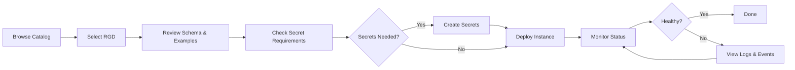

import ProductTag from "@site/src/components/ProductTag";

<ProductTag tags={["oss", "enterprise"]} />

# User Guide

This guide covers the day-to-day usage of Knodex from a developer and viewer perspective. Whether you are deploying new instances, browsing the catalog, or managing secrets, this section walks you through each workflow.

## Role Permissions

Your experience in Knodex depends on the role assigned to you within a project. The two most common roles are **Developer** and **Viewer**.

### Developer Permissions

| Action | Allowed |
|--------|---------|
| Browse catalog | Yes |
| View RGD details and schemas | Yes |
| Deploy new instances | Yes |
| Delete instances | Yes |
| Manage secrets | Yes |
| View instance status | Yes |
| Access deployment modes | Yes |
| Manage project members | No |

### Viewer Permissions

| Action | Allowed |
|--------|---------|
| Browse catalog | Yes |
| View RGD details and schemas | Yes |
| Deploy new instances | No |
| Delete instances | No |
| Manage secrets | No |
| View instance status | Yes |
| Access deployment modes | No |
| Manage project members | No |

## Common Workflows

The following diagram shows the typical user journey through Knodex:

## Navigation Overview

The Knodex sidebar provides access to the main sections of the application:

- **Catalog** -- Browse all available ResourceGraphDefinitions organized by category
- **Instances** -- View and manage deployed instances across your projects
- **Secrets** -- Create and manage secret references required by RGDs
- **Repositories** -- Manage connected Git repositories for GitOps workflows
- **Projects** -- View project settings, members, and repositories
- **Settings** -- Account preferences and application configuration

## Guide Sections

| Section | Description |
|---------|-------------|
| [Browsing the Catalog](browsing-catalog) | Search, filter, and explore ResourceGraphDefinitions |
| [Deploying Instances](deploying-instances) | Step-by-step deployment with forms and YAML preview |
| [Managing Instances](managing-instances) | Monitor status, view details, and delete instances |
| [Managing Secrets](managing-secrets) | Create and manage secret references for deployments |
| [Deployment Modes](deployment-modes) | Direct, GitOps, and Hybrid deployment strategies |
| [Project Management](project-management) | Team members, repositories, and role assignments |
| [Categories](categories) | Organize and browse RGDs by category |

## Best Practices

- **Start with the catalog.** Before deploying, review the RGD schema and examples to understand what parameters are available and which are required.
- **Use meaningful instance names.** Instance names must be DNS-compatible and should describe the purpose of the deployment (e.g., `api-gateway-staging`).
- **Check secret requirements first.** If an RGD requires secrets, create them before starting the deployment form to avoid interruptions.
- **Use GitOps for production.** Direct deployments are convenient for development, but production workloads should use GitOps mode for auditability and rollback capability.
- **Monitor after deployment.** Always verify that your instance reaches a `Healthy` state after deployment. Check events and logs if the status shows `Degraded` or `Unhealthy`.

## Troubleshooting

| Symptom | Likely Cause | Resolution |
|---------|-------------|------------|
| Cannot see any RGDs in catalog | No project membership or empty catalog | Ask an admin to add you to a project |
| Deploy button is disabled | Viewer role or missing required fields | Check your role; fill all required fields |
| Instance stuck in Progressing | Underlying resources still reconciling | Wait a few minutes; check pod events |
| Secret not appearing in dropdown | Secret not created in the correct project | Create the secret in the same project as the deployment |
| Form validation errors | Invalid input for parameter constraints | Review the RGD schema for type and constraint details |
