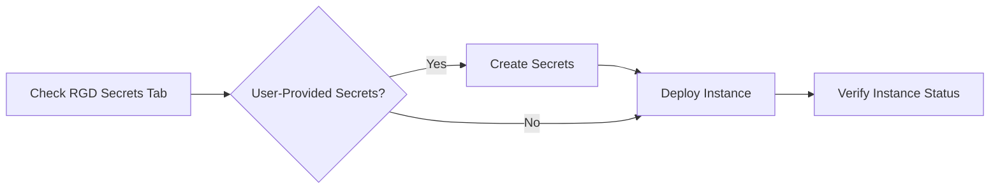

import ProductTag from "@site/src/components/ProductTag";

<ProductTag tags={["oss", "enterprise"]} />

# Managing Secrets

Some ResourceGraphDefinitions require secrets for deployment -- database credentials, API keys, TLS certificates, and other sensitive values. Knodex provides a secrets management interface that lets you create and manage these references within your projects.

## Secret References in RGDs

RGD authors define secret requirements in the RGD specification. Each secret reference has a type that determines how it is provided:

| Type | Description | Who Provides It |
|------|-------------|-----------------|
| `user-provided` | The deployer must create this secret before deployment | You (the deployer) |
| `fixed` | A secret with a predetermined name, managed by the platform team | Platform team |
| `dynamic` | Generated automatically during the deployment process | System |

## Checking Requirements Before Deploying

Before starting a deployment, review the RGD's **Secrets** tab to understand what secrets are needed:

1. Open the RGD in the catalog.
2. Click the **Secrets** tab.
3. Note any secrets marked as `user-provided` -- these must exist before you deploy.
4. Each secret entry shows its name, description, and the keys it must contain.

## The Secrets Page

Navigate to **Secrets** in the sidebar to manage secrets for your projects.

### Viewing Secrets

The secrets list shows all secrets in your current project with their names, types, and creation dates. Click a secret to view its metadata (secret values are never displayed in the UI).

### Creating Secrets

1. Click **Create Secret**.
2. Enter the secret name (must be DNS-compatible).
3. Select the project and namespace.
4. Add the required key-value pairs as specified by the RGD.
5. Click **Save**.

### Deleting Secrets

Select a secret and click **Delete**. Confirm the deletion. Deleting a secret that is referenced by a running instance may cause that instance to become degraded.

### Permissions

| Action | Required Role |
|--------|--------------|
| View secrets list | Viewer or higher |
| View secret metadata | Viewer or higher |
| Create secrets | Developer or higher |
| Delete secrets | Developer or higher |

## Workflow

The recommended workflow for deploying an RGD that requires secrets:



1. **Check requirements** -- Review the Secrets tab on the RGD detail page.
2. **Create secrets** -- Navigate to the Secrets page and create any `user-provided` secrets.
3. **Deploy instance** -- Return to the RGD and start the deployment. The form validates that required secrets exist.

## Best Practices

- **Use descriptive names.** Follow a naming pattern like `{app}-{environment}-{purpose}` (e.g., `myapp-staging-db-creds`).
- **Organize by project.** Keep secrets scoped to the project that uses them. Avoid creating secrets in shared namespaces unless intentionally shared.
- **Rotate regularly.** Update secret values periodically, especially for production credentials.
- **Read RGD author descriptions.** RGD authors should document what each secret key expects. Check the secret description in the RGD specification:

```yaml
secrets:
  - name: db-credentials
    type: user-provided
    description: "Database connection credentials"
    keys:
      - name: username
        description: "Database username with read-write access"
      - name: password
        description: "Database password (minimum 16 characters)"
      - name: host
        description: "Database hostname or IP address"
```
