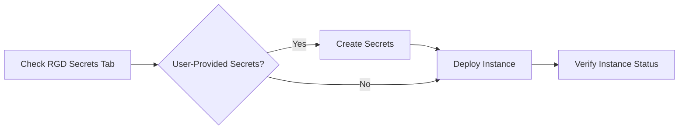

import ProductTag from "@site/src/components/ProductTag";

<ProductTag tags={["oss", "enterprise"]} />

# Managing Secrets

Some ResourceGraphDefinitions require secrets for deployment -- database credentials, API keys, TLS certificates, and other sensitive values. Knodex provides a secrets management interface that lets you create and manage these references within your projects.

## Secret References in RGDs

RGD authors define secret requirements in the RGD specification. Each secret reference has a type that determines how it is provided:

| Type | Description | Who Provides It |
|------|-------------|-----------------|
| `user-provided` | The deployer must create this secret before deployment | You (the deployer) |
| `fixed` | A secret with a predetermined name, managed by the platform team | Platform team |
| `dynamic` | Generated automatically during the deployment process | System |

## Checking Requirements Before Deploying

Before starting a deployment, review the RGD's **Secrets** tab to understand what secrets are needed:

1. Open the RGD in the catalog.
2. Click the **Secrets** tab.
3. Note any secrets marked as `user-provided` -- these must exist before you deploy.
4. Each secret entry shows its name, description, and the keys it must contain.

## The Secrets Page

Navigate to **Secrets** in the sidebar to manage secrets for your projects.

### Viewing Secrets

The secrets list shows one row per secret in the current project, with these columns:

| Column | What it shows |
|--------|---------------|
| Name | The Kubernetes Secret name. A small external-link icon appears next to the name when a [documentation URL](#operational-metadata) is set. |
| Namespace | The namespace the Secret lives in. |
| Keys | Comma-separated list of key names (values are never shown). |
| Rotation | `Auto`, `Manual`, or `—`. See [Operational metadata](#operational-metadata). |
| Status | Color-coded badge derived from the expiration date — `Active`, `Expiring soon` (within 30 days), `Expired`, or `—` when no expiration is set. The expiry hint (e.g., "Expires in 12d") is shown beneath the badge. |
| Updated | When the secret was last touched through Knodex (or its creation time, if it has never been updated). |

Click a row to view the secret's metadata. **Secret values are never displayed in the list.**

### Operational Metadata

When you create or edit a secret you can optionally record three fields that exist purely to remind you and your team about the secret's lifecycle. **Knodex does not act on these values automatically** — no rotation jobs, no email reminders. They are there so the list view tells the right story at a glance.

| Field | Purpose |
|-------|---------|
| **Rotation** (`Manual` or `Auto`) | How this secret gets refreshed. Use `Manual` for secrets you rotate by hand, `Auto` for secrets refreshed by some external automation (External Secrets Operator, Vault sync, etc.). |
| **Documentation URL** | Link to a runbook or owner page. When set, a small icon appears next to the secret's name in the list. Must be `http` or `https`. |
| **Expiration date** | The day the secret is no longer valid. The Status column shows `Expired` once the date is in the past, `Expiring soon` within 30 days, and `Active` otherwise. |

All three fields are **optional**. Leaving them blank produces a normal secret with no extra labels or annotations.

These fields are stored on the underlying Kubernetes Secret as a label (Rotation) and annotations (Documentation URL, Expiration date) — see [Operational Metadata in the admin guide](../administration/secrets-management#operational-metadata) for the exact label/annotation keys and YAML examples.

### Creating Secrets

1. Click **Create Secret**.
2. Enter the secret name (must be DNS-compatible).
3. Select the project and namespace.
4. Add the required key-value pairs as specified by the RGD.
5. *(Optional)* In the **Metadata** section, set the rotation policy, documentation URL, and/or expiration date. All three are optional.
6. Click **Save**.

### Editing Secrets

You can update a secret's values, its metadata, or both — independently.

- **Updating values:** Type a new value next to any key. Keys whose value field you leave empty keep their existing server-side values (a partial update).
- **Updating metadata only:** Change anything in the Metadata section and click **Update**. You do **not** have to also change a value — a metadata-only save is supported.
- **Clearing metadata:** Empty out a metadata field (e.g., delete the URL or clear the date) and save.

If you don't touch the Metadata section at all, the existing labels and annotations on the secret are preserved exactly as they were.

### Deleting Secrets

Select a secret and click **Delete**. Confirm the deletion. Deleting a secret that is referenced by a running instance may cause that instance to become degraded.

### Permissions

| Action | Required Role |
|--------|--------------|
| View secrets list | Viewer or higher |
| View secret metadata | Viewer or higher |
| Create secrets | Developer or higher |
| Delete secrets | Developer or higher |

## Workflow

The recommended workflow for deploying an RGD that requires secrets:


```mermaid
graph LR
    A[Check RGD Secrets Tab] --> B{User-Provided Secrets?}
    B -- Yes --> C[Create Secrets]
    C --> D[Deploy Instance]
    B -- No --> D
    D --> E[Verify Instance Status]
```

1. **Check requirements** -- Review the Secrets tab on the RGD detail page.
2. **Create secrets** -- Navigate to the Secrets page and create any `user-provided` secrets.
3. **Deploy instance** -- Return to the RGD and start the deployment. The form validates that required secrets exist.

## Best Practices

- **Use descriptive names.** Follow a naming pattern like `{app}-{environment}-{purpose}` (e.g., `myapp-staging-db-creds`).
- **Organize by project.** Keep secrets scoped to the project that uses them. Avoid creating secrets in shared namespaces unless intentionally shared.
- **Rotate regularly.** Update secret values periodically, especially for production credentials. Set the **Expiration date** metadata field when you create a credential with a known lifetime — the Status column will turn yellow 30 days before it expires and red once it has expired, so the next rotation is hard to miss.
- **Read RGD author descriptions.** RGD authors should document what each secret key expects. Check the secret description in the RGD specification:

```yaml
secrets:
  - name: db-credentials
    type: user-provided
    description: "Database connection credentials"
    keys:
      - name: username
        description: "Database username with read-write access"
      - name: password
        description: "Database password (minimum 16 characters)"
      - name: host
        description: "Database hostname or IP address"
```
